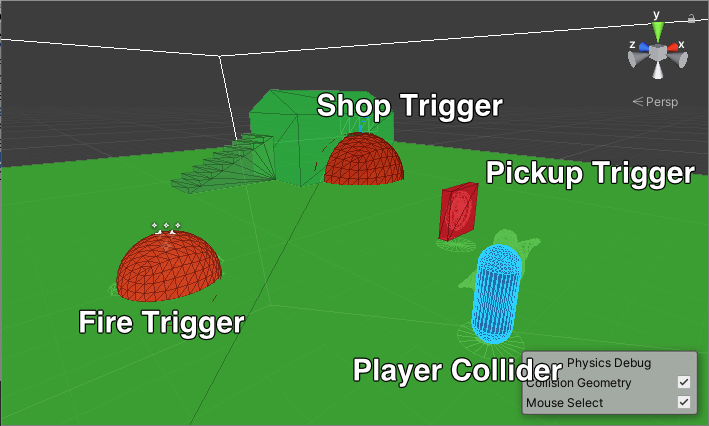
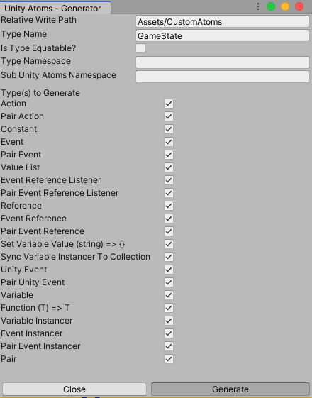
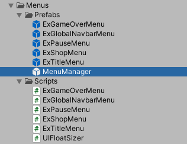

# Unity3D Reactive Menu and Prefab
### A Workflow Example using Unity Atoms and UI Extensions Menus

###### Overview
Game managers and UI Canvas managers can get out of hand and spiral into spaghetti code land quickly as they start to span multiple scenes.

Standard prefab workflow doesn’t allow you to save references to scene managers or scene objects either, so you can quickly end up in a tangles set of singletons that have multiple dependancies and code starts becoming complex and narrowly focused.

An alternative “architecture” is to use Scriptable Objects to store global data which communicate their state changes using events. Scriptable Objects are static assets that live in the project not in individual scenes, they are similar to monobehaviors but don’t have the magic Update methods. Scriptable Objects are often used to store data, like inventory or player stats, they can also contain methods and raise events, which can be subscribed to. By using them to store game data with event that communicate when changes happen you can decouple a lot of your scripts, and use these Scriptable Object assets to replace the multitude of “master” singleton data managers.

I highly recommend Ryan Hipple’s talk on this at Unite in 2017 <https://www.youtube.com/watch?v=raQ3iHhE_Kk>
That talk has a ton of great ideas and ways to help team workflow. It also inspired a few projects to implement it. 
I've tried a couple and found Unity Atoms <https://github.com/AdamRamberg/unity-atoms> my favorite, it has a lot of additional functionality and great Editor support for debugging and testing a scene.

Unity UI Extensions <https://bitbucket.org/UnityUIExtensions/unity-ui-extensions/> is a great set of components that help flesh out some of the missing parts of Unity's UI System (I've used the primitives in most of my menus). 
Unity UI Extensions has a great menu manager, which is a modified version of Adam Kapos - Building an easy to use menu system, he gives a great talk on it here, Yousician at Unite 2017 <https://www.youtube.com/watch?v=wbmjturGbAQ>

Within the menu manager repo you can find a few examples, essentially its a canvas prefab loader that handles canvas states and solves a lot of the usual menu and canvas issues when doing anything remotely complex with multiple UIs.

One of the restrictions of this UI manager is communicating with the scenes as they are segregated "off scene" prefabs. By using the Unity Atoms as the communication “glue” between the prefabs and the scene data you can create an organised event based reactive workflow.

This repository is a demo with these 2 projects combined to handle game health and a shop UI to replenish the player health. I’ve also added a game state listener outside of the scene.

# Scene setup
Trigger colliders which update integer atoms.

## Scripts 
###### Scripts/GameStateTrigger.cs
Changes game state when triggered - used here on the Shop entrance.

###### Scripts/IntValueChangerTrigger.cs
Changes an integer value when entered. Used for the coin pickup and the fire damage.

###### Scripts/ProjectEnums.cs
The enums for the game states

###### Scripts/GlobalManagerSO.cs
This is the definition for the Global Manager Scriptable Object which lives outside the scene. Once written you need an instance in the project (ScriptableObjects/GlobalManager.asset). This handles opening the shop menu when it detects a game state change and monitors player health and shows the gameover menu.

## Atoms
I created a custom atom from an enum to communicate “global” game states. There is a generator supplied within Atoms, the result is in the "CustomAtoms" folder.
One oddity with C# is enums don't fully support equitability (IMPORTANT: note the equatable is unticked for this one). After generation I had to modify the generated code in CustomAtoms/Variables/GameStateVariable.cs  

Other Atoms are standard base atoms, player health and coins collected. There is also a "PlayerCanMove" boolean stops player input in menus. 

## Menu Manager & Menu Prefabs
The menu system requires a class and prefab naming scheme to be followed and the MenuManager needs to be added to every scene. 

## Game Manager Scriptable Object
The scriptable object subscribes to the changes to the Global game state atom. This allows communication from the prefab menus and scene. 

# Assets used links
 
To get the scene up and running quickly I’ve use the standard assets third person controller and some programmer art

### from:
Wrestler from Mixamo <https://www.mixamo.com/> (decimated in Blender <https://www.blender.org/> )

The block color shader is by Carlos Wilkes <http://carloswilkes.com/> from <https://assetstore.unity.com/packages/tools/animation/lean-transition-144107>

Standard Assets character controller and animations
<https://assetstore.unity.com/packages/essentials/asset-packs/standard-assets-for-unity-2018-4-32351>

Font: Luckiest Guy <https://fonts.google.com/specimen/Luckiest+Guy>

Flipbook images are cartoonified (Cutout filter) versions of flipbooks from Unity Labs
<https://blogs.unity3d.com/2016/11/28/free-vfx-image-sequences-flipbooks/>

